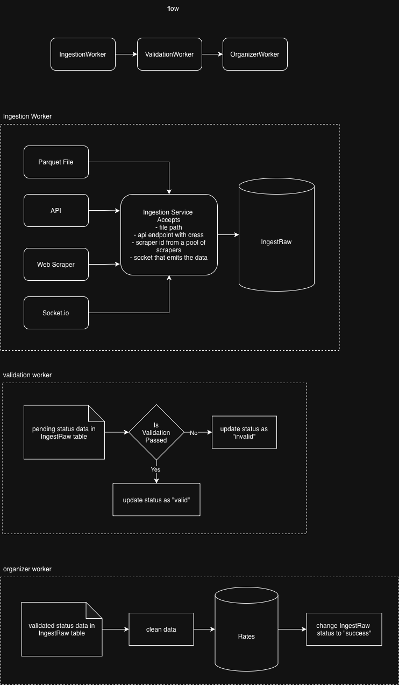

## Assumptions

- Designed for very large files; implemented a 3-stage ingestion pipeline that is non-blocking and horizontally scalable

## Idempotency Strategy

- Enforced via a unique constraint at the database level; duplicate inserts are naturally rejected

## Tradeoff

- The async ingestion pipeline introduces additional complexity in implementation and maintenance, and does not provide immediate feedback. Observability currently relies on logs.

## Improvement (with more time)

- Enhance error handling and observability in the async pipeline. Failures should be easier to diagnose, and retries should be more controlled instead of relying on the next scheduled run.
