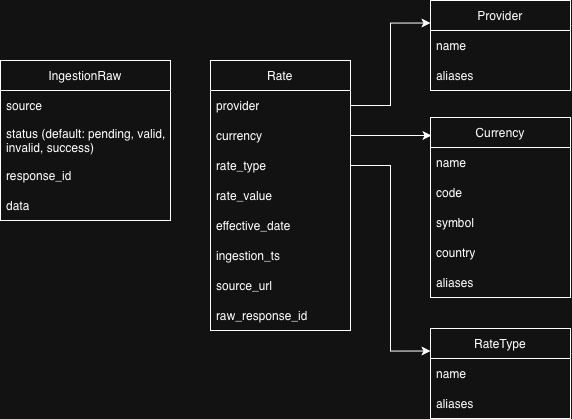

# Database Schema

## Diagram

## Models Overview

### 1. Provider

Stores the entities providing the exchange rate data.

- `name` (String, Unique): Canonical name of the provider.
- `aliases` (JSON List): Alternative names found in raw data sources.

### 2. Currency

Stores currency details.

- `name` (String): Full name of the currency.
- `code` (String, Unique): ISO 4217 currency code (e.g., USD, EUR).
- `symbol` (String, Optional): Currency symbol (e.g., $).
- `country` (String, Optional): Associated country.
- `aliases` (JSON List): Alternative codes or names.

### 3. RateType

Classifies the type of rate.

- `name` (String, Unique): Type of rate (e.g., "Sell", "Buy", "Mid").
- `aliases` (JSON List): Alternative names used by different sources.

### 4. Rate

The core transactional table storing the actual exchange rates.

- `provider` (FK): Reference to `Provider`.
- `currency` (FK): Reference to `Currency`.
- `rate_type` (FK): Reference to `RateType`.
- `rate_value` (Decimal): The numeric exchange rate.
- `effective_date` (Date): The date the rate is applicable to.
- `ingestion_ts` (DateTime): When the record was ingested.
- `source_url` (URL, Optional): Origin of the data.
- `raw_response_id` (String, Unique): Traceability link back to the raw source data.

### 5. IngestRaw

Stores unprocessed data from ingestion hooks/scrapers.

- `source` (String): Source identifier (e.g., "api", "parquet").
- `status` (String): Current processing state (Pending, Valid, Invalid, Success).
- `response_id` (String, Unique): Unique identifier for the raw record.
- `data` (JSON): The raw payload.

---

## Design Rationale

### Why the `alias` field is important?

Data sources are often messy and inconsistent. One source might label a provider as "X-Rates" while another uses "xrates.com". The `alias` field allows the ingestion worker to perform **fuzzy matching** or **lookup mapping**, ensuring distinct raw labels are correctly rolled up into a single, clean canonical record. This prevents duplicate entities and maintains data consistency.

### Why separate tables (Provider, RateType, Currency)?

1. **Normalization**: Avoids repeating the same strings (e.g., "United States Dollar") millions of times in the `Rate` table, which significantly reduces storage size.
2. **Data Integrity**: Ensures that a currency or provider only has one canonical name and set of metadata (like symbols or country codes).
3. **Performance**: Searching/filtering by an Integer ID (Foreign Key) is much faster than searching by long strings across millions of rows.
4. **Rich Metadata**: Allows storing additional information about a currency or provider without cluttering the transactional `Rate` data.
